# Laboratório 01B

### Exercício 1
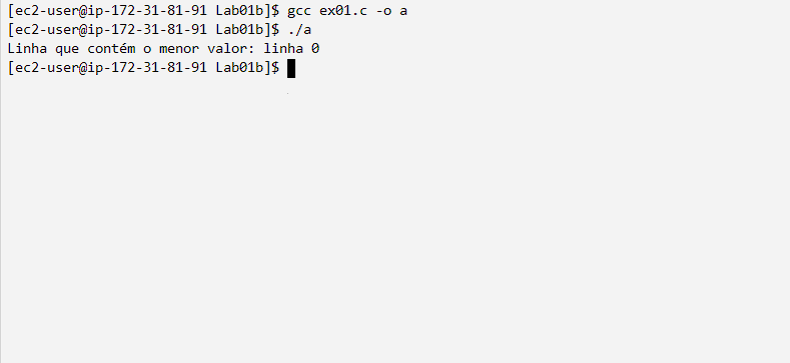

### Exercício 2
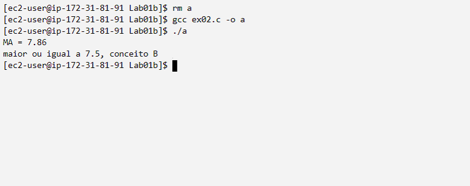

### Exercício 3
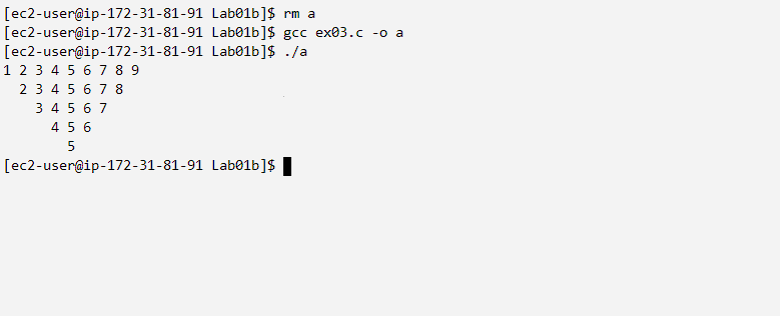

### Exercício 4
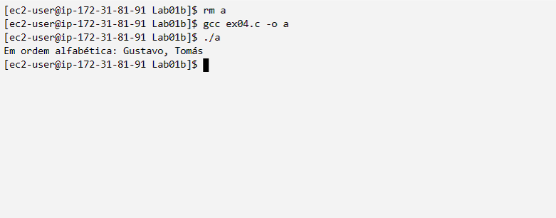
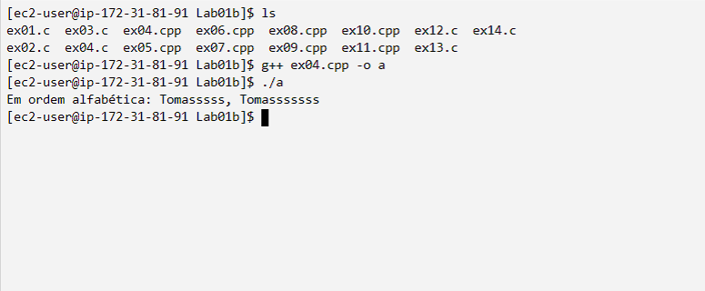

### Exercício 5
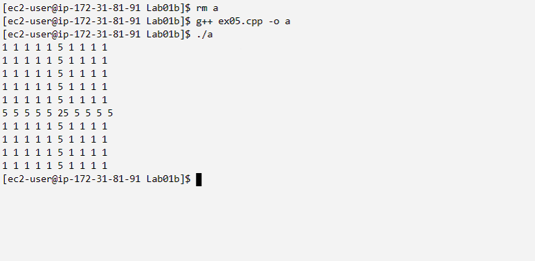

### Exercício 6
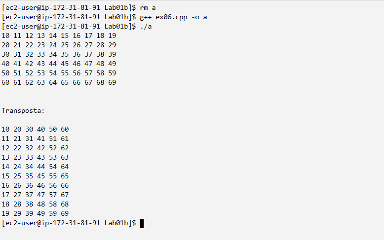

### Exercício 7
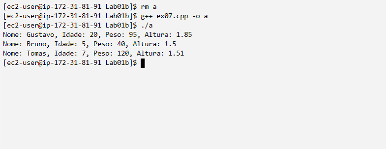

### Exercício 8
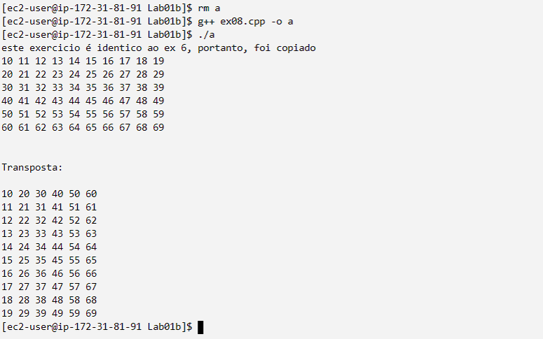

### Exercício 9
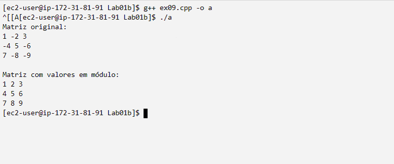

### Exercício 10
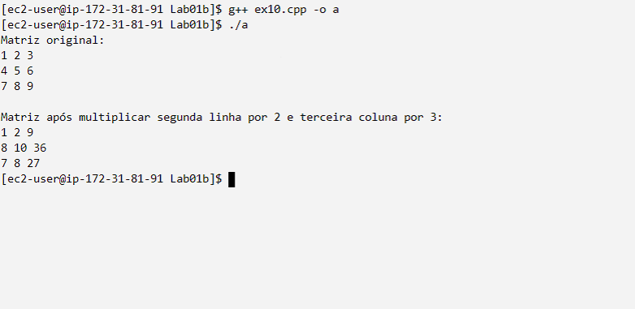

### Exercício 11
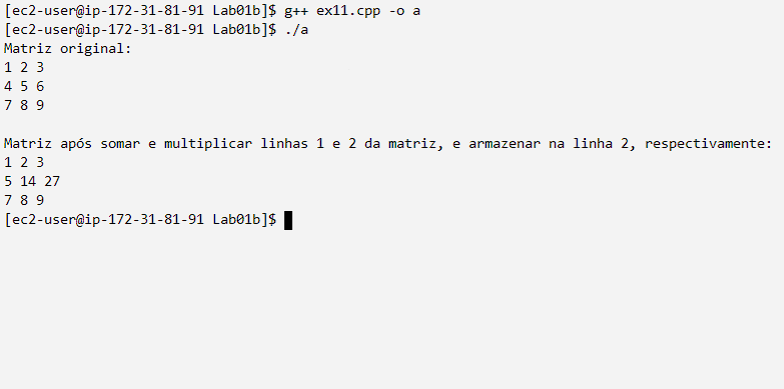

### Exercício 12
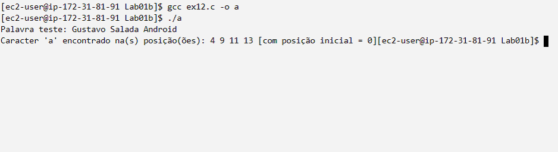

### Exercício 13
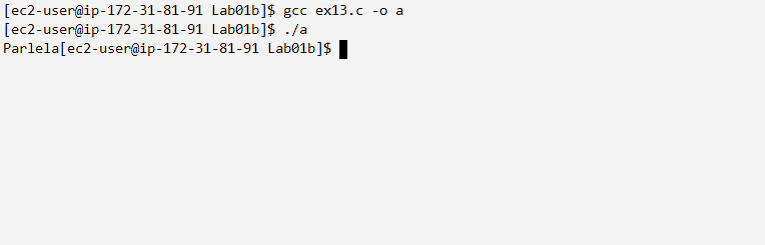

### Exercício 14
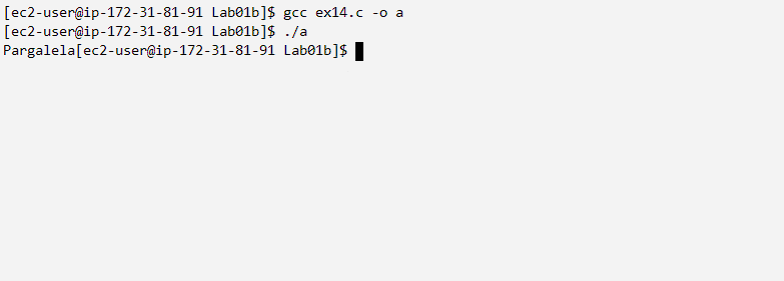
